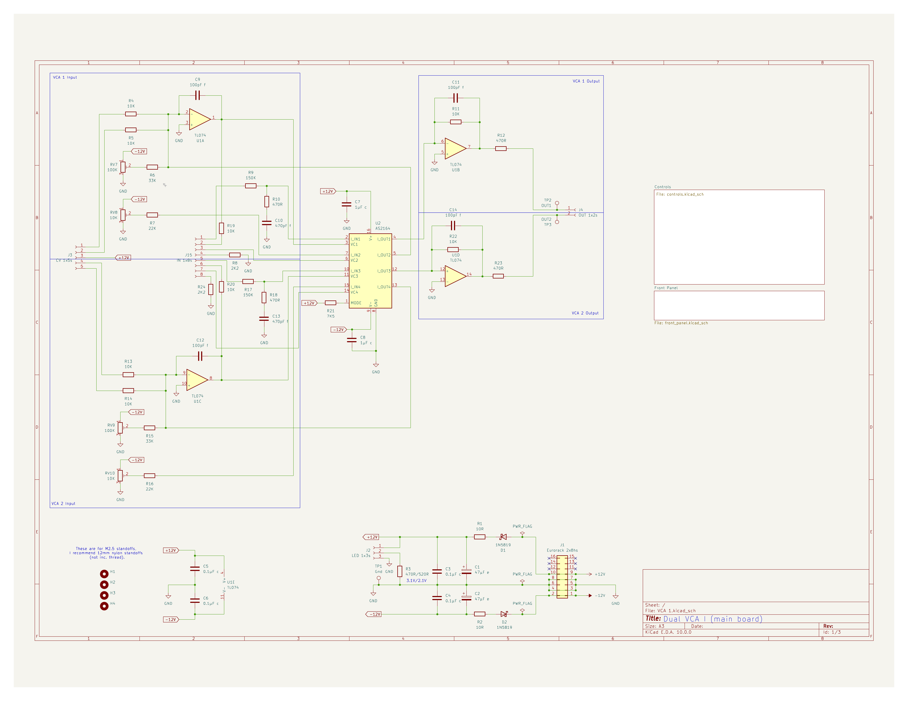
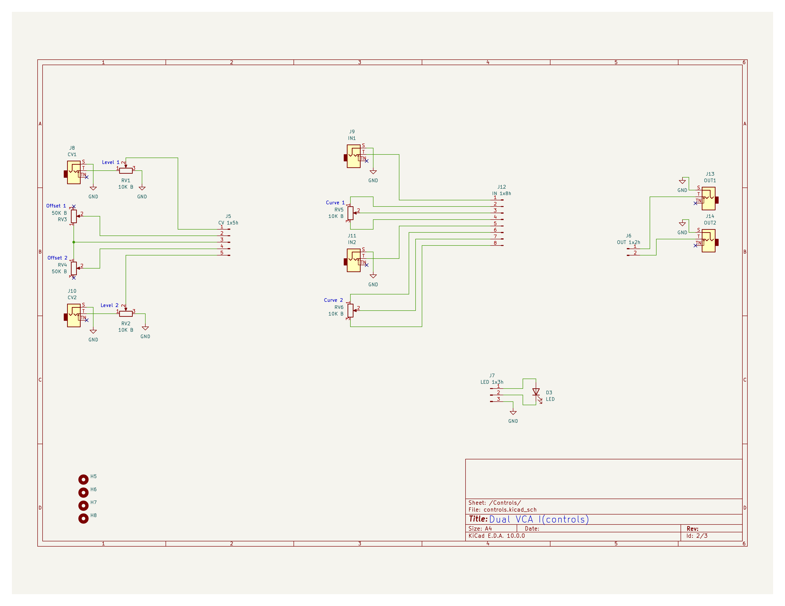

# VCA 1

This dual VCA AS2164 VCA is based on the Hagiwo's [Dual VCA Rev.2](https://note.com/solder_state/n/nd82c027d0597). 

To calibrate the range for each VCA (Where *n* is the VCA number) using the test points:

1. Set the Offset pot to be closed. Now measure at CV*n* and ensure it is at 0V, now measure at OUT*n* and adjust the 100k (104) trim pot until the output is 0.
2. Still with the Offset pot closed, measure CV*n* and ensure it is at 5V, now check the IN*n* V and record it, next measure OUT*n* and adjust the 10K (103) trimpot and ensure the OUT*n* V == IN*n* V. NB: You can set it to more or less if you like but less than x0.1 or more than x5 makes the VCA hard to use.  
